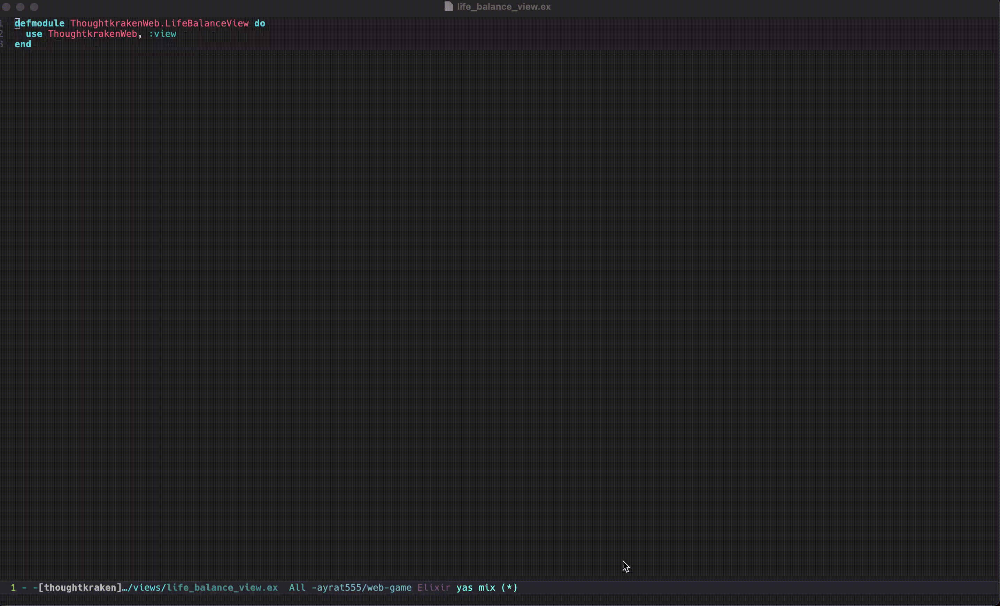

# mix.el

Emacs Minor Mode for Mix, a build tool that ships with Elixir.

## Demo

### Select MIX_ENV and add custom params (`MIX_ENV=dev mix help hex.config`)



`C-u C-u C-u C-c d e`

### Select a project and run a command (`mix clean` inside of subproject)


`C-c d d e`

## Installation

### MELPA

Set up the MELPA or MELPA Stable repository if you haven't already and install with M-x package-install RET mix RET.

Or you can use `use-package`:

```lisp
(use-package mix
  :config
  (add-hook 'elixir-mode-hook 'mix-minor-mode))
```

### From file

Add `mix.el` to your load path:

``` lisp
(add-to-list 'load-path "path/to/mix.el")
```

## Setup

Add a hook to the mode that you're using with Elixir, for example, `elixir-mode`:

``` lisp
(add-hook 'elixir-mode-hook 'mix-minor-mode)
```

Set `compilation-scroll-output` to non-nil to scroll the *mix* buffer window as output appears. The value ‘first-error’ stops scrolling at the first error, and leaves point on its location in the *mix* buffer. For example:

``` lisp
(setq compilation-scroll-output t)
```

## Usage

<kbd> C-c d e </kbd> - `mix-execute-task` - List all available tasks and execute one of them. It starts in the root of the umbrella app. As a bonus, you'll get a documentation string because `mix.el` parses shell output of `mix help` directly. Starts in the umbrella root directory.

<kbd> C-c d d e </kbd> - `mix-execute-task` in an umbrella subproject - The same as `mix-execute-task` but allows you choose a subproject to execute a task in.

<kbd> C-c d t </kbd> - `mix-test` - Run all test in the app. It starts in the umbrella root directory.

<kbd> C-c d d t </kbd> - `mix-test` in an umbrella subproject - The same as `mix-test` but allows you to choose a subproject to run tests in.

<kbd> C-c d o </kbd> - `mix-test-current-buffer` - Run all tests in the current buffer. It starts in the umbrella root directory.

<kbd> C-c d d o </kbd> - `mix-test-current-buffer` in an umbrella subproject - The same as `mix-test-current-buffer` but runs tests directly from subproject directory.

<kbd> C-c d f </kbd> - `mix-test-current-test` - Run the current test where pointer is located. It starts in the umbrella root directory.

<kbd> C-c d d f </kbd> - `mix-test-current-test` in an umbrella subproject - The same as `mix-test-current-test` but runs a test directly from subproject directory.

<kbd> C-c d l </kbd> - `mix-last-command` - Execute the last mix command.

These are all commands that I use most frequently. You can execute any mix tasks (credo, dialyzer etc) available in the project using `mix-execute-task`. If you have suggestions for additional commands to add keybindings to, please create an issue.

To change prefix (default <kbd>C-c d</kbd>) use:

```el
 (define-key mix-minor-mode-map (kbd ...) 'mix-minor-mode-command-map)
```

## Prefixes to modify commands before execution

Add these prefixes before commands described in the previous section.

`C-u` - Choose `MIX_ENV` env variable.

`C-u C-u` - Add extra params for mix task.

`C-u C-u C-u` - Choose `MIX_ENV` and add extra params.

For example, to create a migration in a subproject you should press:

`C-u C-u C-c d d e`:
1. `C-u C-u` - to be prompted for migration name
2. `C-c d d e` - to select a mix project and `ecto.gen.migration` task
